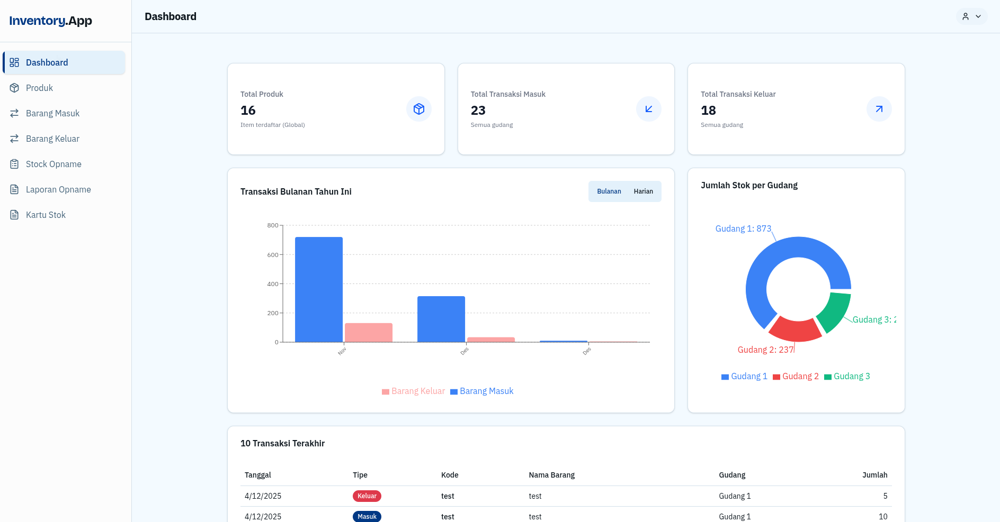
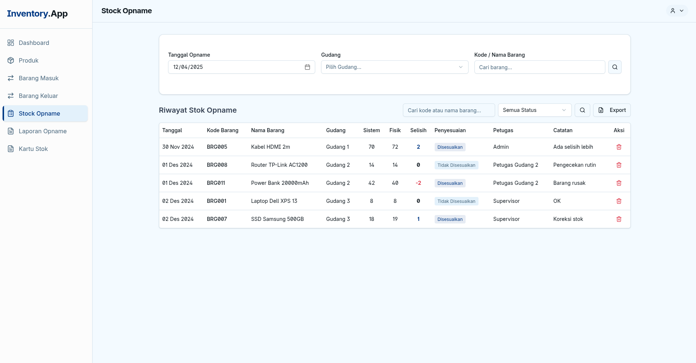

# Stock Inventory

Aplikasi manajemen stok barang.

## Setup

1. Install dependencies:

   ```bash
   bun install
   ```

2. Setup environment variables:

   ```bash
   cp .env.example .env
   ```

   > **Note:** Update `SESSION_SECRET` di file `.env` dengan string acak yang aman. Anda bisa membuatnya dengan command: `openssl rand -hex 32`.

3. Jalankan aplikasi:
   ```bash
   bun run dev
   ```

## Screenshots




